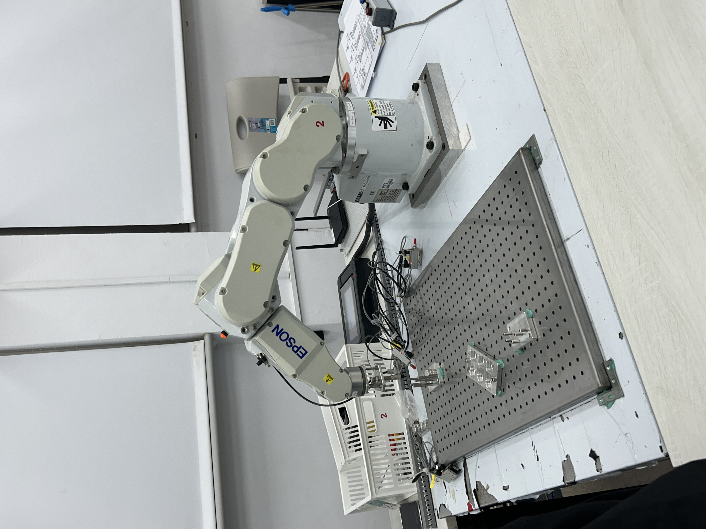
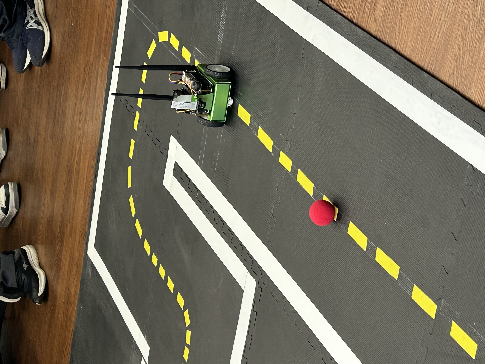
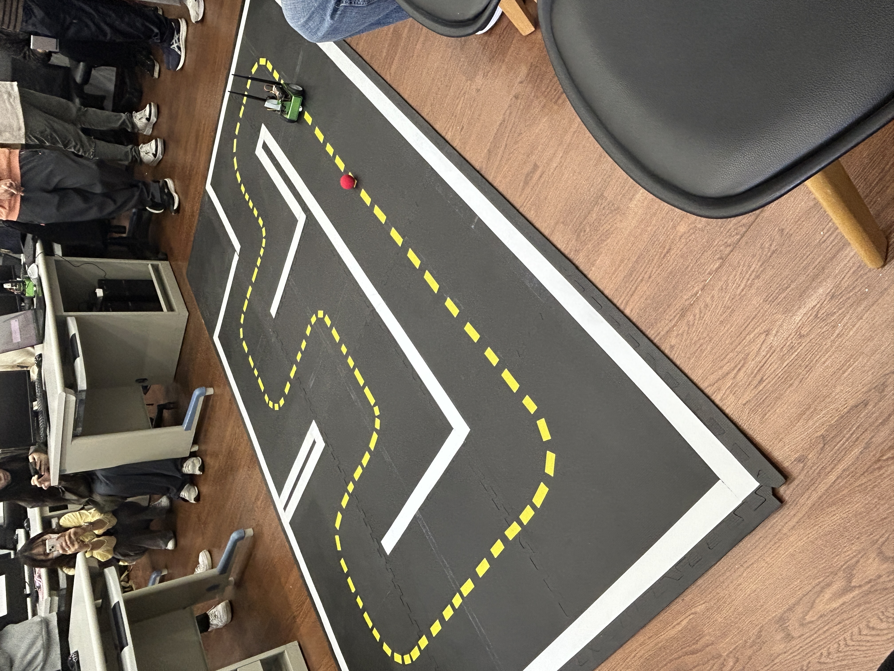
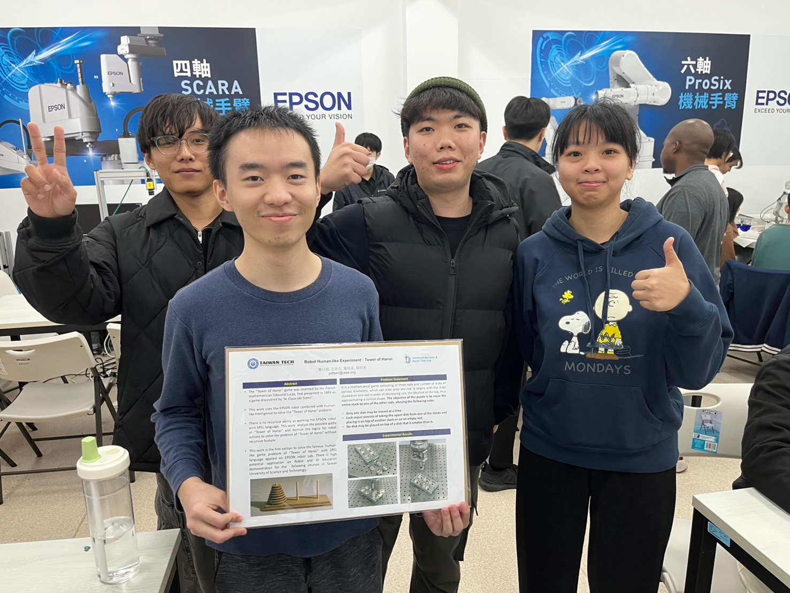

# AMV_robot_A1

## Robot 作業要求:

- Task 0: Simulation 10%
- Task 1: Pick and Place 20%
- Task 2: Stacking 20%
- Task 3: Integration 30% -- Tower of Hanoi (河內塔)

## 分工:

- 曾衍迪: 撰寫 Task 2: Stacking 程式、 AMR 程式撰寫
- 左其右: 撰寫 Task 1: Pick and Place 程式、 AMR 程式撰寫、Robot手臂操作
- 蔡明亮: Robot 手臂操作、 Task3 程式撰寫
- 童筱真: Robot 手臂操作、 Task3 程式撰寫

## 檔案架構說明:

- PickPlace 資料夾: Task 1 (Pick and Place)
- Stacking 資料夾: Task 2 (Stacking)
- HanoiTower 資料夾: Task 3 (Tower of Hanoi)
- AMR 資料夾:
    - AMR_tracking: Nvidia AMR 循跡與避障小車

## Tower of Hanoi (河內塔) 演算法機器手臂視覺化
### 說明

河內塔是一種經典的演算法。此專案使用 EPSON 機器手臂來呈現河內塔的動作流程，將演算法概念進行物理 3D 視覺化

#### 基本規則:

- 只能一次移動一個圓盤
- 大圓盤不能放在小圓盤之上
- 目標是將所有圓盤從起始柱移動到目標柱，並保持順序不變

### 展示影片

我們已錄製影片展示機器手臂實現河內塔演算法的過程，請參考以下連結:

- 三層河內塔 https://youtube.com/shorts/qjWXErI6N6E?feature=share
- 五層河內塔 https://youtube.com/shorts/iUrSXxSLM_8

## 影片

Task 1: Pick and Place
https://youtube.com/shorts/rPW8IcBnuKM

## 照片

照片連結
https://drive.google.com/drive/folders/1-4BytwRLLqqa_SVLYE1lsAb8Z0YUsayc?usp=sharing

EPSON Robot Arm

Nvidia Jetson Nano AMR

Task 3 Poster 合照

