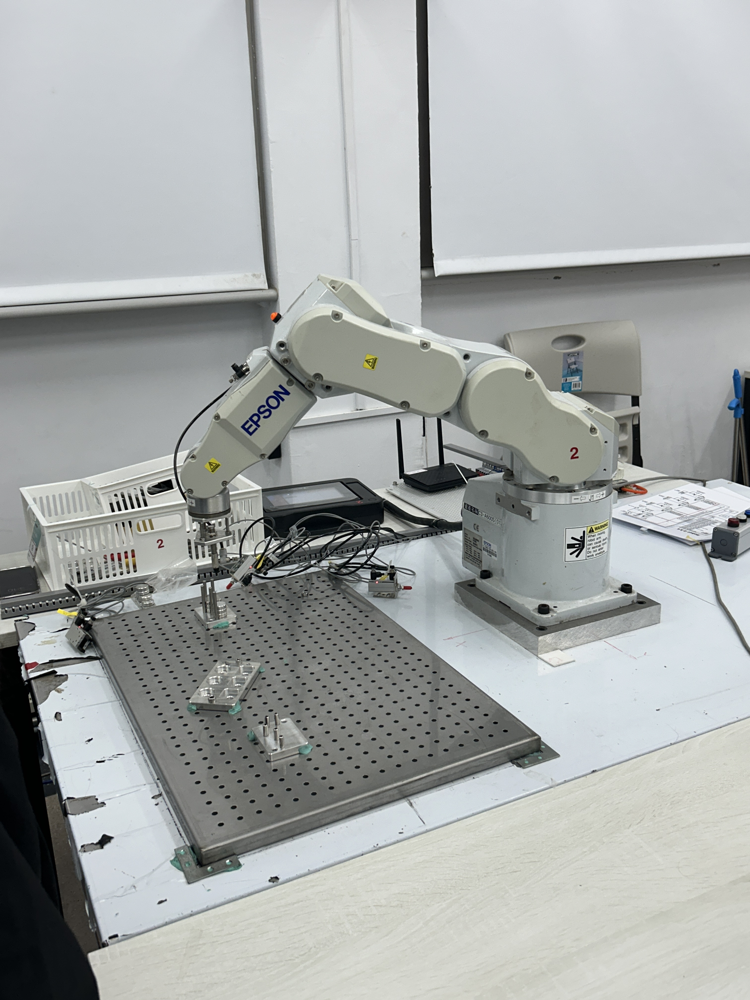

# AMV_robot_A1

## AMV Robot 作業要求:

- Task 0: Simulation 10%
- Task 1: Pick and Place 20%
- Task 2: Stacking 20%
- Task 3: Integration 30% -- Tower of Hanoi (河內塔)

## 分工:

- 曾衍迪: 撰寫 Task 2: Stacking 程式、 AGV 程式撰寫
- 左其右: 撰寫 Task 1: Pick and Place 程式、 AGV 程式撰寫、 AMV Robot 手臂操作
- 蔡明亮: AMV Robot 手臂操作、 Task3 程式撰寫
- 童筱真: AMV Robot 手臂操作、 Task3 程式撰寫

* Robot Programming (RO)
* Electrial (EE)
* Mechanical (ME)

## 檔案架構說明:

- PickPlace 資料夾: Task 1 (Pick and Place)
- Stacking 資料夾: Task 2 (Stacking)
- HanoTower 資料夾: Task 3 (Tower of Hanoi)
- AVG 資料夾:
    - AGV_tracking: Nvidia AGV 循跡與避障小車

## 照片:

